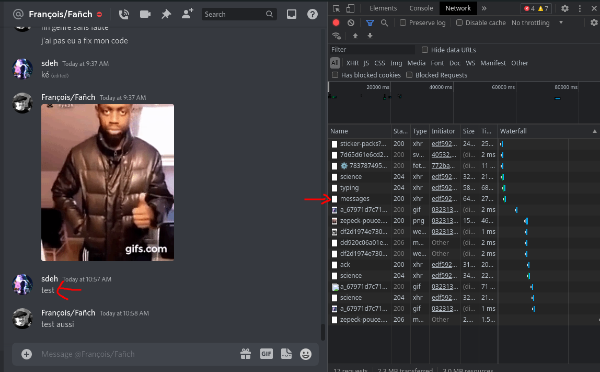
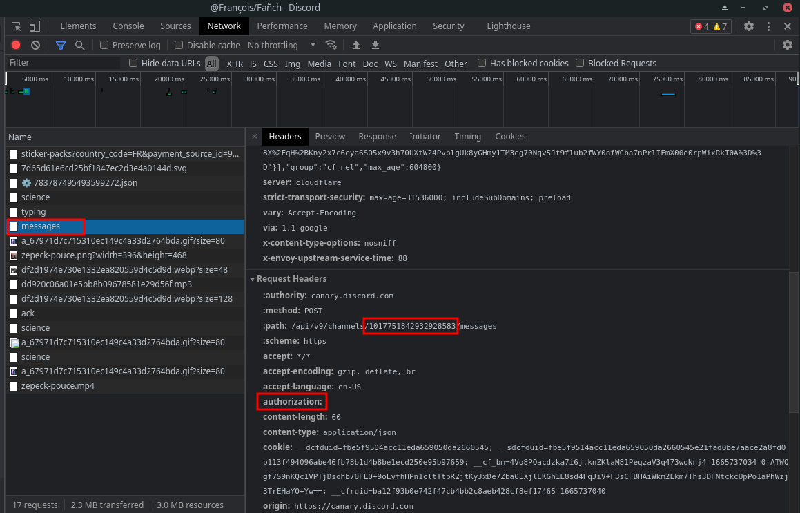
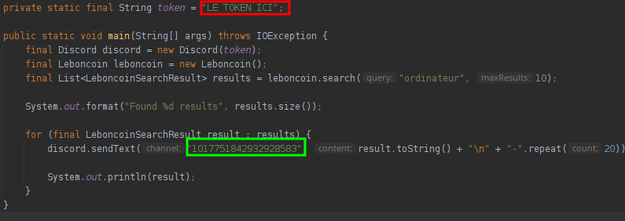

# Setup

## Récupérer le token et id du channel

1. Ouvrir [l'inspecteur](https://i.pinimg.com/236x/79/73/e8/7973e827be90ed6ee2b98019083af634--cartoon-illustrations-inspector-gadget.jpg) avec `CTRL+SHIT+I`. Si le raccourci ne marche pas > [Activer Devtools](#activer-devtools)
2. Aller dans l'onglet `network`
3. Envoyer un mesage
4. Une requête va apparaître dans la liste a droite:  

5. Ouvrir la requête et récupérer les infos ici:  

    Le `token` c'est la valeur après `authorization` et le `channelId` c'est la valeur dans l'url (premier rectangle rouge)
6. Aller dans le code et remplacer la valeur dans le rectangle rouge par le token (`authorization`) et le rectangle vert par le `channelId`  


⚠️ Ne spammez pas trop sinon vous allez être bloqué par l'API discord pendant quelques heures

<br>

## Activer devtools

Si le raccourci `CTRL+SHIFT+I` ne fonctionne pas, il faut:

1. Ouvrir le `settings.json`
    - Windows 💩  
        Ouvrir cmd et faire la commande
        ```
        code "%appdata%/discord/settings.json"
        ```
    - Linux ✨  
        Ouvrir un ✨ terminal ✨, faire la commande 
        ```
        code ~/.config/discord/settings.json
        ```
    - Mac 💰💸🤑  
        Ouvrir un terminal, faire la commande 
        ```
        code ~/Library/Application Support/discord/settings.json
        ```
2. Rajouter a la fin, avant la dernière `}`:
    ```json
    "DANGEROUS_ENABLE_DEVTOOLS_ONLY_ENABLE_IF_YOU_KNOW_WHAT_YOURE_DOING": true
    ```
    *(faut pas faire attention au nom du truc)*
3. Relancez discord (pas que la fenêtre, faut le fermer vraiment, genre avec l'inspecteur des tâches ou en bas a droite avec la flèche)
4. Là c'est bon